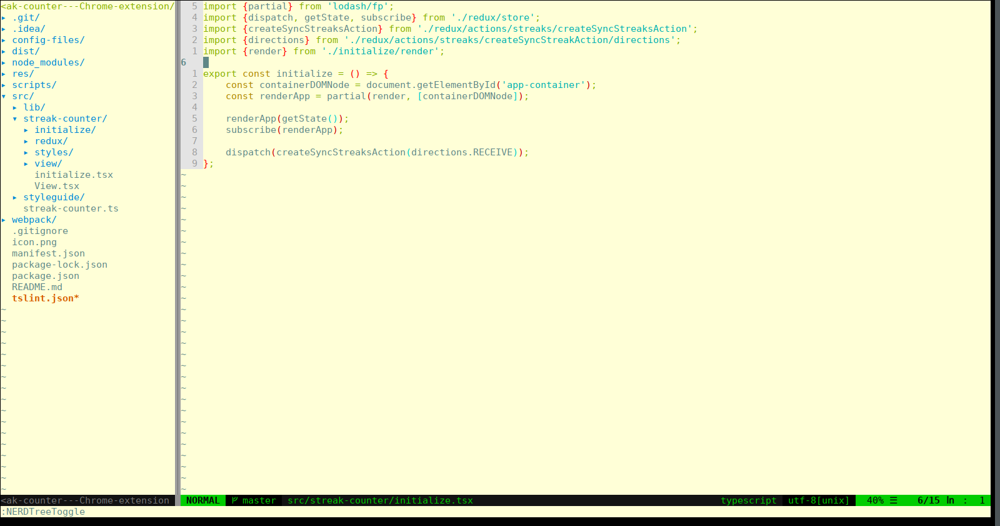

# Vim config

This is my personal vim config. I will try to explain
everything inside this README, both for everyone interested
as well as a reference for myself.



## Install

Clone this repo and create a symlink.

```
$ mkdir ~/.config/nvim
$ ln -s ~/.config/nvim/init.vim ./init.vim
```

Install vim-plug by following the instructions on the github page.
Then open vim and run `:PlugInstall`.

## General vim settings and commands

### vim config changes
To be able to use config changes in any open vim instance,
I introduced a key mapping which will reload the vim config
with the config in the home directory by typing: `,+`.

### Auto save
Autosave is enabled. Now every change in the buffer will
be saved automatically. No more `:w` needed.

### Line length
I highlight all characters on position 81 and above
to make sure lines are small enough so I can have
multiple buffers in a splitview.

### Leader key
I mapped the leader key to the `,` sign.
This makes it a lot easier than hitting Esc all the time.

### Buffer handling
Closing a buffer works by typing `,q`.
Closing all buffers - including NERDTree - (will close vim
as well) is done by typing `,a`

## Custom key mappings

* Close current buffer: `<leader>q`
* Close vim (close all buffers): `<leader>a`
* Move line one up: `K`
* Move line one down: `J`
